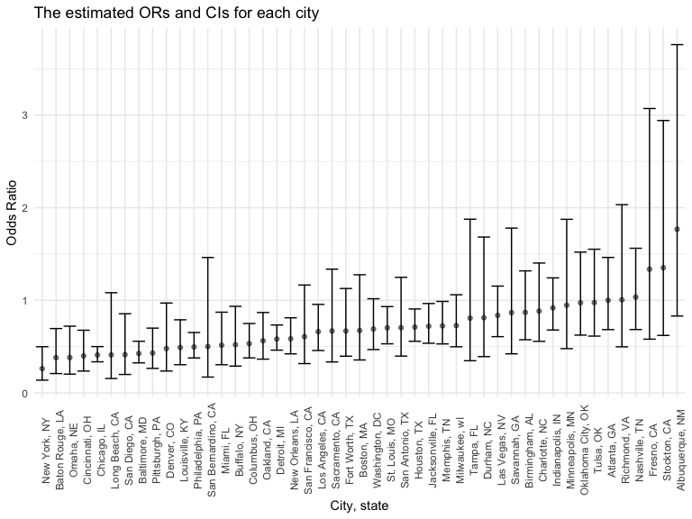

P8105_hw6_qx2222
================
Qiaoyi Xu
2022-12-01

``` r
library(tidyverse)
library(modelr)
library(mgcv)
```

    ## 载入需要的程辑包：nlme

    ## 
    ## 载入程辑包：'nlme'

    ## The following object is masked from 'package:dplyr':
    ## 
    ##     collapse

    ## This is mgcv 1.8-40. For overview type 'help("mgcv-package")'.

## Problem 1 (answer posted)

To obtain a distribution for $\hat{r}^2$, we’ll follow basically the
same procedure we used for regression coefficients: draw bootstrap
samples; the a model to each; extract the value I’m concerned with; and
summarize. Here, we’ll use `modelr::bootstrap` to draw the samples and
`broom::glance` to produce `r.squared` values.

``` r
weather_df = 
  rnoaa::meteo_pull_monitors(
    c("USW00094728"),
    var = c("PRCP", "TMIN", "TMAX"), 
    date_min = "2017-01-01",
    date_max = "2017-12-31") %>%
  mutate(
    name = recode(id, USW00094728 = "CentralPark_NY"),
    tmin = tmin / 10,
    tmax = tmax / 10) %>%
  select(name, id, everything())
```

    ## Registered S3 method overwritten by 'hoardr':
    ##   method           from
    ##   print.cache_info httr

    ## file min/max dates: 1869-01-01 / 2022-11-30

``` r
weather_df %>% 
  modelr::bootstrap(n = 1000) %>% 
  mutate(
    models = map(strap, ~lm(tmax ~ tmin, data = .x) ),
    results = map(models, broom::glance)) %>% 
  select(-strap, -models) %>% 
  unnest(results) %>% 
  ggplot(aes(x = r.squared)) + geom_density()
```


In this example, the $\hat{r}^2$ value is high, and the upper bound at 1
may be a cause for the generally skewed shape of the distribution. If we
wanted to construct a confidence interval for $R^2$, we could take the
2.5% and 97.5% quantiles of the estimates across bootstrap samples.
However, because the shape isn’t symmetric, using the mean +/- 1.96
times the standard error probably wouldn’t work well.

We can produce a distribution for $\log(\beta_0 * \beta1)$ using a
similar approach, with a bit more wrangling before we make our plot.

``` r
weather_df %>% 
  modelr::bootstrap(n = 1000) %>% 
  mutate(
    models = map(strap, ~lm(tmax ~ tmin, data = .x) ),
    results = map(models, broom::tidy)) %>% 
  select(-strap, -models) %>% 
  unnest(results) %>% 
  select(id = `.id`, term, estimate) %>% 
  pivot_wider(
    names_from = term, 
    values_from = estimate) %>% 
  rename(beta0 = `(Intercept)`, beta1 = tmin) %>% 
  mutate(log_b0b1 = log(beta0 * beta1)) %>% 
  ggplot(aes(x = log_b0b1)) + geom_density()
```


As with $r^2$, this distribution is somewhat skewed and has some
outliers.

The point of this is not to say you should always use the bootstrap –
it’s possible to establish “large sample” distributions for strange
parameters / values / summaries in a lot of cases, and those are great
to have. But it is helpful to know that there’s a way to do inference
even in tough cases.

## Problem 2

### Data import

``` r
homicide = read_csv("data/homicide-data.csv") #import 'homicide' data
```

    ## Rows: 52179 Columns: 12
    ## ── Column specification ────────────────────────────────────────────────────────
    ## Delimiter: ","
    ## chr (9): uid, victim_last, victim_first, victim_race, victim_age, victim_sex...
    ## dbl (3): reported_date, lat, lon
    ## 
    ## ℹ Use `spec()` to retrieve the full column specification for this data.
    ## ℹ Specify the column types or set `show_col_types = FALSE` to quiet this message.

### Data cleaning

``` r
homicide = homicide %>%
  mutate(city_state = str_c(city, ", ", state)) %>%
  mutate(homicide_status = if_else(disposition == "Closed without arrest", "unresolved",
                                   if_else(disposition == "Open/No arrest", "unresolved",
                                           if_else(disposition == "Closed by arrest", "resolved", NA_character_)))) %>%
  filter(!(city_state %in% c("Dallas, TX", "Phoenix, AZ", "Kansas City, MO", "Tulsa, AL"))) %>% #omit observations
  filter(victim_race %in% c("Black", "White")) %>% #limit your analysis those for whom victim_race is white or black
  mutate(victim_age = as.numeric(victim_age)) %>% # Be sure that victim_age is numeric
  drop_na(victim_age)


homicide
```

    ## # A tibble: 39,403 × 14
    ##    uid   repor…¹ victi…² victi…³ victi…⁴ victi…⁵ victi…⁶ city  state   lat   lon
    ##    <chr>   <dbl> <chr>   <chr>   <chr>     <dbl> <chr>   <chr> <chr> <dbl> <dbl>
    ##  1 Alb-…  2.01e7 SATTER… VIVIANA White        15 Female  Albu… NM     35.1 -107.
    ##  2 Alb-…  2.01e7 MULA    VIVIAN  White        72 Female  Albu… NM     35.1 -107.
    ##  3 Alb-…  2.01e7 BOOK    GERALD… White        91 Female  Albu… NM     35.2 -107.
    ##  4 Alb-…  2.01e7 MARTIN… GUSTAVO White        56 Male    Albu… NM     35.1 -107.
    ##  5 Alb-…  2.01e7 GRAY    STEFAN… White        43 Female  Albu… NM     35.1 -107.
    ##  6 Alb-…  2.01e7 DAVID   LARRY   White        52 Male    Albu… NM     NA     NA 
    ##  7 Alb-…  2.01e7 BRITO   ELIZAB… White        22 Female  Albu… NM     35.1 -107.
    ##  8 Alb-…  2.01e7 KING    TEVION  Black        15 Male    Albu… NM     35.1 -107.
    ##  9 Alb-…  2.01e7 BOYKIN  CEDRIC  Black        25 Male    Albu… NM     35.1 -107.
    ## 10 Alb-…  2.01e7 BARRAG… MIGUEL  White        20 Male    Albu… NM     35.1 -107.
    ## # … with 39,393 more rows, 3 more variables: disposition <chr>,
    ## #   city_state <chr>, homicide_status <chr>, and abbreviated variable names
    ## #   ¹​reported_date, ²​victim_last, ³​victim_first, ⁴​victim_race, ⁵​victim_age,
    ## #   ⁶​victim_sex

### For the city of Baltimore, MD

``` r
fit_log_MD = homicide %>% #use the glm function to fit a logistic regression
  filter(city_state == "Baltimore, MD") %>%
  mutate(homicide_status = fct_relevel(homicide_status, "resloved")) %>%
  glm(homicide_status ~ victim_age + victim_sex + victim_race, data = ., family = binomial())%>%
  broom::tidy() %>%
  mutate(OR = exp(estimate),
         CI_lower = exp(estimate - 1.96*std.error),
         CI_higher = exp(estimate + 1.96*std.error)) %>%
  select(term, estimate, OR, CI_lower, CI_higher) %>%
  knitr::kable(digits = 3, col.names = c("Term", "Estimate", "Odds ratio", "95CI_low","95CI_high"))

fit_log_MD
```

| Term             | Estimate | Odds ratio | 95CI_low | 95CI_high |
|:-----------------|---------:|-----------:|---------:|----------:|
| (Intercept)      |   -0.310 |      0.733 |    0.524 |     1.026 |
| victim_age       |    0.007 |      1.007 |    1.000 |     1.013 |
| victim_sexMale   |    0.854 |      2.350 |    1.793 |     3.081 |
| victim_raceWhite |   -0.842 |      0.431 |    0.306 |     0.607 |

### Run glm for each of the cities

``` r
homicide_cities = homicide %>% #use the glm function to fit a logistic regression
  mutate(homicide_status = fct_relevel(homicide_status, "resloved")) %>%
  nest(data = -city_state) %>%
  mutate(
    models = map(.x = data, ~ glm(homicide_status ~ victim_age + victim_sex + victim_race, data = .x, family = binomial())),
    output = map (models, broom::tidy))%>%
  select(city_state, output) %>%
  unnest(output) %>%
  mutate(OR = exp(estimate),
         CI_lower = exp(estimate - 1.96*std.error),
         CI_higher = exp(estimate + 1.96*std.error)) %>%
  select(city_state, term, estimate, OR, CI_lower, CI_higher) %>%
  filter(term == "victim_sexMale")

homicide_cities %>%
  knitr::kable(digits = 3, col.names = c("City, state", "Term", "Estimate", "Odds ratio", "95CI_low","95CI_high"))
```

| City, state        | Term           | Estimate | Odds ratio | 95CI_low | 95CI_high |
|:-------------------|:---------------|---------:|-----------:|---------:|----------:|
| Albuquerque, NM    | victim_sexMale |   -0.570 |      0.566 |    0.266 |     1.204 |
| Atlanta, GA        | victim_sexMale |    0.000 |      1.000 |    0.683 |     1.463 |
| Baltimore, MD      | victim_sexMale |    0.854 |      2.350 |    1.793 |     3.081 |
| Baton Rouge, LA    | victim_sexMale |    0.964 |      2.622 |    1.438 |     4.779 |
| Birmingham, AL     | victim_sexMale |    0.139 |      1.149 |    0.759 |     1.741 |
| Boston, MA         | victim_sexMale |    0.395 |      1.484 |    0.784 |     2.809 |
| Buffalo, NY        | victim_sexMale |    0.653 |      1.921 |    1.069 |     3.451 |
| Charlotte, NC      | victim_sexMale |    0.123 |      1.131 |    0.713 |     1.795 |
| Chicago, IL        | victim_sexMale |    0.891 |      2.438 |    1.998 |     2.976 |
| Cincinnati, OH     | victim_sexMale |    0.917 |      2.501 |    1.477 |     4.236 |
| Columbus, OH       | victim_sexMale |    0.630 |      1.878 |    1.334 |     2.644 |
| Denver, CO         | victim_sexMale |    0.736 |      2.087 |    1.030 |     4.230 |
| Detroit, MI        | victim_sexMale |    0.541 |      1.717 |    1.363 |     2.164 |
| Durham, NC         | victim_sexMale |    0.208 |      1.231 |    0.594 |     2.551 |
| Fort Worth, TX     | victim_sexMale |    0.402 |      1.495 |    0.887 |     2.519 |
| Fresno, CA         | victim_sexMale |   -0.289 |      0.749 |    0.326 |     1.723 |
| Houston, TX        | victim_sexMale |    0.341 |      1.406 |    1.103 |     1.793 |
| Indianapolis, IN   | victim_sexMale |    0.085 |      1.088 |    0.805 |     1.472 |
| Jacksonville, FL   | victim_sexMale |    0.329 |      1.389 |    1.036 |     1.864 |
| Las Vegas, NV      | victim_sexMale |    0.178 |      1.194 |    0.867 |     1.646 |
| Long Beach, CA     | victim_sexMale |    0.891 |      2.438 |    0.924 |     6.430 |
| Los Angeles, CA    | victim_sexMale |    0.413 |      1.511 |    1.046 |     2.183 |
| Louisville, KY     | victim_sexMale |    0.712 |      2.039 |    1.266 |     3.282 |
| Memphis, TN        | victim_sexMale |    0.324 |      1.383 |    1.012 |     1.890 |
| Miami, FL          | victim_sexMale |    0.663 |      1.941 |    1.147 |     3.284 |
| Milwaukee, wI      | victim_sexMale |    0.319 |      1.375 |    0.943 |     2.005 |
| Minneapolis, MN    | victim_sexMale |    0.054 |      1.056 |    0.533 |     2.091 |
| Nashville, TN      | victim_sexMale |   -0.034 |      0.967 |    0.640 |     1.460 |
| New Orleans, LA    | victim_sexMale |    0.536 |      1.710 |    1.233 |     2.371 |
| New York, NY       | victim_sexMale |    1.338 |      3.811 |    2.003 |     7.249 |
| Oakland, CA        | victim_sexMale |    0.574 |      1.776 |    1.151 |     2.739 |
| Oklahoma City, OK  | victim_sexMale |    0.026 |      1.027 |    0.658 |     1.602 |
| Omaha, NE          | victim_sexMale |    0.961 |      2.614 |    1.387 |     4.927 |
| Philadelphia, PA   | victim_sexMale |    0.701 |      2.015 |    1.533 |     2.648 |
| Pittsburgh, PA     | victim_sexMale |    0.842 |      2.322 |    1.429 |     3.772 |
| Richmond, VA       | victim_sexMale |   -0.006 |      0.994 |    0.492 |     2.008 |
| San Antonio, TX    | victim_sexMale |    0.350 |      1.419 |    0.801 |     2.515 |
| Sacramento, CA     | victim_sexMale |    0.402 |      1.495 |    0.748 |     2.988 |
| Savannah, GA       | victim_sexMale |    0.143 |      1.153 |    0.562 |     2.368 |
| San Bernardino, CA | victim_sexMale |    0.692 |      1.999 |    0.684 |     5.841 |
| San Diego, CA      | victim_sexMale |    0.884 |      2.421 |    1.170 |     5.012 |
| San Francisco, CA  | victim_sexMale |    0.498 |      1.646 |    0.858 |     3.157 |
| St. Louis, MO      | victim_sexMale |    0.352 |      1.422 |    1.073 |     1.885 |
| Stockton, CA       | victim_sexMale |   -0.301 |      0.740 |    0.340 |     1.610 |
| Tampa, FL          | victim_sexMale |    0.214 |      1.238 |    0.533 |     2.876 |
| Tulsa, OK          | victim_sexMale |    0.025 |      1.025 |    0.644 |     1.630 |
| Washington, DC     | victim_sexMale |    0.371 |      1.449 |    0.983 |     2.135 |

### Create a plot that shows the estimated ORs and CIs for each city

``` r
prob2_plot = homicide_cities %>%
  mutate(city_state = reorder(city_state, OR)) %>%
  ggplot(aes(x = city_state, y = OR))+
  geom_point(alpha = .5) +
  geom_errorbar(aes(ymin = CI_lower, ymax = CI_higher))+
  labs(x = "City, state", y = "Odds Ratio",
       title = "The estimated ORs and CIs for each city") +
  theme(axis.text.x = element_text(angle = 90))

prob2_plot
```



``` r
ggsave(
  filename = "results/plot for each city(problem 2).pdf",
  plot = prob2_plot,
  width = 30,
  height = 20,
  units = "cm"
  ) #export plot to 'results' directory
```

## Problem 3

### Load and clean the data

``` r
birthweight = read_csv("data/birthweight.csv") #import 'birthweight' data
```

    ## Rows: 4342 Columns: 20
    ## ── Column specification ────────────────────────────────────────────────────────
    ## Delimiter: ","
    ## dbl (20): babysex, bhead, blength, bwt, delwt, fincome, frace, gaweeks, malf...
    ## 
    ## ℹ Use `spec()` to retrieve the full column specification for this data.
    ## ℹ Specify the column types or set `show_col_types = FALSE` to quiet this message.

``` r
birthweight
```

    ## # A tibble: 4,342 × 20
    ##    babysex bhead blength   bwt delwt fincome frace gaweeks malform menarche
    ##      <dbl> <dbl>   <dbl> <dbl> <dbl>   <dbl> <dbl>   <dbl>   <dbl>    <dbl>
    ##  1       2    34      51  3629   177      35     1    39.9       0       13
    ##  2       1    34      48  3062   156      65     2    25.9       0       14
    ##  3       2    36      50  3345   148      85     1    39.9       0       12
    ##  4       1    34      52  3062   157      55     1    40         0       14
    ##  5       2    34      52  3374   156       5     1    41.6       0       13
    ##  6       1    33      52  3374   129      55     1    40.7       0       12
    ##  7       2    33      46  2523   126      96     2    40.3       0       14
    ##  8       2    33      49  2778   140       5     1    37.4       0       12
    ##  9       1    36      52  3515   146      85     1    40.3       0       11
    ## 10       1    33      50  3459   169      75     2    40.7       0       12
    ## # … with 4,332 more rows, and 10 more variables: mheight <dbl>, momage <dbl>,
    ## #   mrace <dbl>, parity <dbl>, pnumlbw <dbl>, pnumsga <dbl>, ppbmi <dbl>,
    ## #   ppwt <dbl>, smoken <dbl>, wtgain <dbl>

``` r
birthweight = birthweight %>%
  mutate(babysex = as.factor(babysex),
         babysex = recode_factor(babysex, "1" = "Male", "2" = "Female"),
         frace = as.factor(frace),
         frace = recode_factor(frace, 
                               "1" = "White", "2" = "Black", "3" = "Asian", 
                               "4" = "Puerto Rican", "8" = "Other", "9" = "Unknown"),
         malform = as.factor(malform),
         malform = recode_factor(malform, "0" = "Absent", "1" = "Present"),
         mrace = as.factor(mrace),
         mrace = recode_factor(mrace, 
                               "1" = "White", "2" = "Black", "3" = "Asian", "4" = "Puerto Rican", "8" = "Other"))

skimr::skim(birthweight) #check missing data
```

|                                                  |             |
|:-------------------------------------------------|:------------|
| Name                                             | birthweight |
| Number of rows                                   | 4342        |
| Number of columns                                | 20          |
| \_\_\_\_\_\_\_\_\_\_\_\_\_\_\_\_\_\_\_\_\_\_\_   |             |
| Column type frequency:                           |             |
| factor                                           | 4           |
| numeric                                          | 16          |
| \_\_\_\_\_\_\_\_\_\_\_\_\_\_\_\_\_\_\_\_\_\_\_\_ |             |
| Group variables                                  | None        |

Data summary

**Variable type: factor**

| skim_variable | n_missing | complete_rate | ordered | n_unique | top_counts                              |
|:--------------|----------:|--------------:|:--------|---------:|:----------------------------------------|
| babysex       |         0 |             1 | FALSE   |        2 | Mal: 2230, Fem: 2112                    |
| frace         |         0 |             1 | FALSE   |        5 | Whi: 2123, Bla: 1911, Pue: 248, Asi: 46 |
| malform       |         0 |             1 | FALSE   |        2 | Abs: 4327, Pre: 15                      |
| mrace         |         0 |             1 | FALSE   |        4 | Whi: 2147, Bla: 1909, Pue: 243, Asi: 43 |

**Variable type: numeric**

| skim_variable | n_missing | complete_rate |    mean |     sd |     p0 |     p25 |     p50 |     p75 |   p100 | hist  |
|:--------------|----------:|--------------:|--------:|-------:|-------:|--------:|--------:|--------:|-------:|:------|
| bhead         |         0 |             1 |   33.65 |   1.62 |  21.00 |   33.00 |   34.00 |   35.00 |   41.0 | ▁▁▆▇▁ |
| blength       |         0 |             1 |   49.75 |   2.72 |  20.00 |   48.00 |   50.00 |   51.00 |   63.0 | ▁▁▁▇▁ |
| bwt           |         0 |             1 | 3114.40 | 512.15 | 595.00 | 2807.00 | 3132.50 | 3459.00 | 4791.0 | ▁▁▇▇▁ |
| delwt         |         0 |             1 |  145.57 |  22.21 |  86.00 |  131.00 |  143.00 |  157.00 |  334.0 | ▅▇▁▁▁ |
| fincome       |         0 |             1 |   44.11 |  25.98 |   0.00 |   25.00 |   35.00 |   65.00 |   96.0 | ▃▇▅▂▃ |
| gaweeks       |         0 |             1 |   39.43 |   3.15 |  17.70 |   38.30 |   39.90 |   41.10 |   51.3 | ▁▁▂▇▁ |
| menarche      |         0 |             1 |   12.51 |   1.48 |   0.00 |   12.00 |   12.00 |   13.00 |   19.0 | ▁▁▂▇▁ |
| mheight       |         0 |             1 |   63.49 |   2.66 |  48.00 |   62.00 |   63.00 |   65.00 |   77.0 | ▁▁▇▂▁ |
| momage        |         0 |             1 |   20.30 |   3.88 |  12.00 |   18.00 |   20.00 |   22.00 |   44.0 | ▅▇▂▁▁ |
| parity        |         0 |             1 |    0.00 |   0.10 |   0.00 |    0.00 |    0.00 |    0.00 |    6.0 | ▇▁▁▁▁ |
| pnumlbw       |         0 |             1 |    0.00 |   0.00 |   0.00 |    0.00 |    0.00 |    0.00 |    0.0 | ▁▁▇▁▁ |
| pnumsga       |         0 |             1 |    0.00 |   0.00 |   0.00 |    0.00 |    0.00 |    0.00 |    0.0 | ▁▁▇▁▁ |
| ppbmi         |         0 |             1 |   21.57 |   3.18 |  13.07 |   19.53 |   21.03 |   22.91 |   46.1 | ▃▇▁▁▁ |
| ppwt          |         0 |             1 |  123.49 |  20.16 |  70.00 |  110.00 |  120.00 |  134.00 |  287.0 | ▅▇▁▁▁ |
| smoken        |         0 |             1 |    4.15 |   7.41 |   0.00 |    0.00 |    0.00 |    5.00 |   60.0 | ▇▁▁▁▁ |
| wtgain        |         0 |             1 |   22.08 |  10.94 | -46.00 |   15.00 |   22.00 |   28.00 |   89.0 | ▁▁▇▁▁ |

### Propose a regression model for birthweight

As we know, Genetics, age of the parent, Length of Pregnancy, Mother’s
habits, Baby’s Gender, Ethnicity are important factors to influence
baby’s birth weight. Besides, I would like to focus on the mother’s
condition as factors in the influence of birthweight. So, I took them as
predictors into my regression model, such as delwt, gaweeks, mheight,
momage, mrace, smoken.

``` r
birthweight_mymodel = lm(bwt ~ delwt + gaweeks + mheight + momage + mrace + smoken, data = birthweight)
  
birthweight_mymodel %>%
  broom::tidy() %>%
  knitr::kable(digits = 3)
```

| term              | estimate | std.error | statistic | p.value |
|:------------------|---------:|----------:|----------:|--------:|
| (Intercept)       | -411.762 |   182.091 |    -2.261 |   0.024 |
| delwt             |    5.299 |     0.323 |    16.384 |   0.000 |
| gaweeks           |   54.540 |     2.103 |    25.932 |   0.000 |
| mheight           |   12.857 |     2.740 |     4.692 |   0.000 |
| momage            |   -1.367 |     1.802 |    -0.758 |   0.448 |
| mraceBlack        | -292.555 |    14.918 |   -19.610 |   0.000 |
| mraceAsian        |  -43.856 |    66.434 |    -0.660 |   0.509 |
| mracePuerto Rican | -115.997 |    29.906 |    -3.879 |   0.000 |
| smoken            |  -11.725 |     0.903 |   -12.983 |   0.000 |

### Create a plot of model residuals against fitted values

``` r
plot_residual_mymodel = birthweight %>%
  add_predictions(birthweight_mymodel)%>%
  add_residuals(birthweight_mymodel) %>%
  ggplot(aes(x = pred, y = resid, color = resid))+
  geom_point() +
  geom_smooth(se = F, color = "red", method = "lm")+
  labs(x = "Fitted values", y = "Residuals",
       title = "Residuals v.s. Fitted values") 

plot_residual_mymodel
```

    ## `geom_smooth()` using formula 'y ~ x'


``` r
ggsave(
  filename = "results/residual v.s. Fitted Values of mymodel (problem 3).pdf",
  plot = plot_residual_mymodel,
  width = 30,
  height = 20,
  units = "cm"
  ) #export plot to 'results' directory
```

    ## `geom_smooth()` using formula 'y ~ x'

### Compare your model to two others

One using length at birth and gestational age as predictors (main
effects only) One using head circumference, length, sex, and all
interactions (including the three-way interaction) between these

``` r
cv_df = crossv_mc(birthweight,100) %>%
  mutate(
    train = map(train, as_tibble),
    test = map(test, as_tibble))

cv_df = 
  cv_df %>% 
  mutate(
    my_mod  = map(train, ~lm(bwt ~ delwt + gaweeks + mheight + momage + mrace + smoken, data = .x)),
    main_effect_mod  = map(train, ~lm(bwt ~ blength + gaweeks, data = .x)),
    interaction_mod  = map(train, ~lm(bwt ~ bhead + blength + babysex + 
                                        bhead*blength + bhead*babysex + blength*babysex + bhead*babysex +
                                        bhead*blength*babysex, data = .x))) %>%
  mutate(
    rmse_linear = map2_dbl(my_mod, test, ~rmse(model = .x, data = .y)),
    rmse_smooth = map2_dbl(main_effect_mod, test, ~rmse(model = .x, data = .y)),
    rmse_wiggly = map2_dbl(interaction_mod, test, ~rmse(model = .x, data = .y)))
```

``` r
cv_df %>% 
  select(starts_with("rmse")) %>% 
  pivot_longer(
    everything(),
    names_to = "model", 
    values_to = "rmse",
    names_prefix = "rmse_") %>% 
  mutate(model = fct_inorder(model)) %>% 
  ggplot(aes(x = model, y = rmse)) + 
  geom_violin()
```


